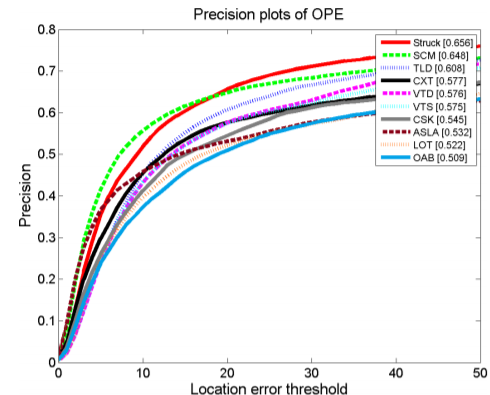
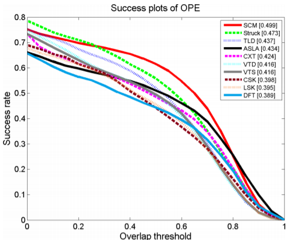
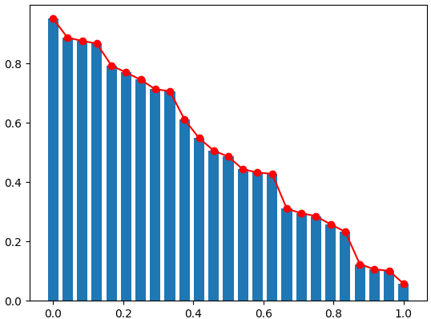

# REVISITING THE DETAILS WHEN EVALUATING AVISUAL TRACKER

The work is for encouraging use of average-overlap-ratio(AOR) to replace plots in OTB(http://cvlab.hanyang.ac.kr/tracker_benchmark/) with theoritical guarantee, to help visual tracking reseach community increase information intensity in limited space of publications.

We commonly see a lot of plots when evaluating the visual tracker on OTB, but most commonly just to show the AUC scores of on sucess plots legend section:





Recalling that the success plot is based on discrete per-frame overlap ratio data points, the curves are just smoothed line charts which seem continuous, with bit of calculus knowledge and referring to Ferrers diagram:


The AUC score was just the AOR over whole testing dataset, which we can easily prove by showing a bar chart consisting of descendingly sorted columns, each of height=one\_frame\_overlap\_ratio, width=1/frame\_num:



Such bar plot is actually the transposed success plot, thus based on the feature of Ferrers diagram(the area do not change after transpose) the formerly used AUC scored is an approximate of overall AOR considering sampling errors etc.

So we can confidently use AOR based on tracker evaluation metrics, making these plots an optional choice for presentation. This seems tedious but can provide a lot of benefits for our research.

AOR based evaluation support single frame all the way to whole testing dataset level tracker evaluation, and we can easily define some statistically indicators for showing the feature of the tracker, i.e. use variance of video sequence level AOR to show the generality/robustness of the tracker.

Based on AOR, I show there are some important hidden details in former benchmarking methodology, partially due to no one can show hundreds of plots in the paper to fully present these details:

+ Tracker performance is imbalance on different video sequences(tasks), those commonly failed tasks are hidden by short video sequence length, the formerly used AUC could not well address this issue. One may try average of video sequence level average overlap ratio(AoAOR) to show the generality of the tracker.
+ There is no absolute winner among selected deep trackers, some inferior trackers do perform much better on few tasks. Instead of trying to design a tracker for all kinds of application, I suggest combining them(by ensemble approach etc.) and carefully selecting the proper one for concrete scenario.
+ Based on video sequence level AOR, we can get the task rank list for the tracking algorithm, from its best performing task to worst one. Two rank lists could be used for designing a tracker-distance(TD), by using one as reference to assign numerical ids, using another one for counting reverse pairs so we can measure how different two trackers are on the given benchmark.(i.e. {Dive, Jump, Bike} and {Jump, Bike, Dive} would be transformed to {1, 2, 3} and {2, 3, 1}, there are 2 reverse pairs in {2, 3, 1} while the maximum possible reverse pair number is (3 * (3-1) /2), thus these two trackers have TD of 2/3).

Re-search is sometimes revisiting the details in classical method for new findings. Instead of creating new benchmarks, we can also make progress by reusing classical benchmarks with fine-grained evaluation metrics. Performance imbalance issue may be ubiquitous without being paid enough attention before. We may have overpromised for being able to provide unified solution for specific tasks. Sometimes step back can also help us making more progress, especially for industry-use-oriented work.

Tex source(based on AWESOME https://github.com/kourgeorge/arxiv-style) and some scripts are provided in this repo, for efficient counting reverse pairs, pls refer to https://github.com/pmixer/misc.samples/tree/master/python_extension/inverse_pair_counter, hope this repo could do be more helpful than https://github.com/pmixer/otb.plugin.

Collaborators interested in turning this report into a real paper are more than welcomed.

```bibtex

```